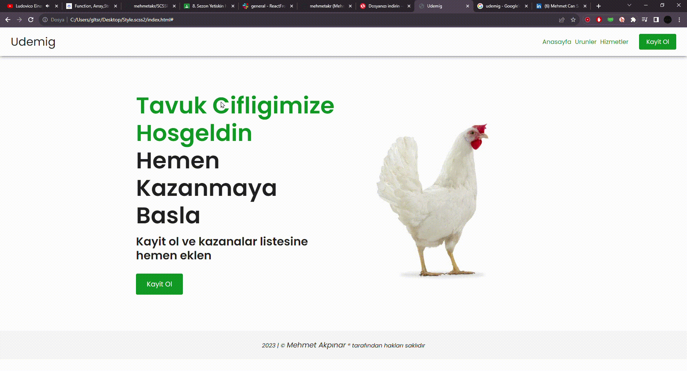

<h1> SCSS PROJE  2 </h1>

Bu proje scss teknolojileri kullanılarak gerçekleştirilmiştir.

-Color klasöründe renklerin tanımlaması yapılmıştır.
 

<h2>Kullanilan Teknolojiler</h2>

-SCSS
-HTML
-CSS

<h1>Proje Gif</h1>

